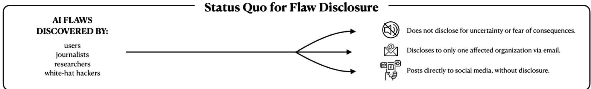
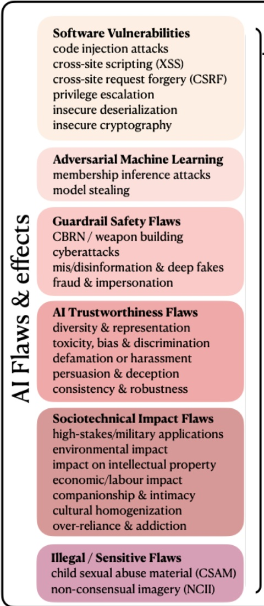

## I n-House Evaluation Is Not Enough:

## Towards Robust Third-Party Flaw Disclosure for General-Purpose AI

Shayne Longpre*, Kevin Klyman*, Ruth E Appel*, Sayash Kapoor, Rishi Bommasani, Michelle Sahar, Sean McGregor, Avijit Ghosh, Borhane Bili-Hamelin, Nathan Butters, Alondra Nelson, Amit Elazari, Andrew Sellars, Casey John Ellis, Dane Sherrets, Dawn Song, Harley Geiger, Ilona Cohen, Lauren McIlvenny, Madhulika Srikumar, Mark M Jaycox, Markus Anderljung, Nadine Farid Johnson, Nicholas Carlini, Nicolas Mialhe, Nik Marda, Peter Henderson, Rebecca S Portnoff, Rebecca Weiss, Victoria Westerhoff, Yacine Jernite, Rumman Chowdhury, Percy Liang, Arvind Narayanan

## Problem Statement

AI systems, agents, and their applications have many risks. However, there are obstacles to mitigation:

1. An absence of flaw reporting culture

2. Limited disclosure infrastructure (eg bug bounties)

3. No legal protections for third-party evaluators

## Recommendations

We recommend the AI community adopt 3 conventions from the software security community:

1. Evaluators should submit flaw reports

2. AI developers should adopt flaw disclosure programs, to coordinate universally transferable flaws

3. AI developers should protect evaluators with safe harbors

## Next Steps

We are building out a flaw report form, that is:

A. Fast, and convenient to fill-out

B. Collects information that makes it easy for developers to validate, triage, and reproduce reported flaws

Coordinated Flaw Disclosure

Paper Link

## Schema for a Flaw Report

<table border=1 style='margin: auto; width: max-content;'><tr><td style='text-align: center;'>Report Type</td><td style='text-align: center;'>Field Name</td><td style='text-align: center;'>Field Description</td></tr><tr><td rowspan="18">Collected for All Flaw Reports</td><td style='text-align: center;'>Reporter ID</td><td style='text-align: center;'>Anonymous or real identity of flaw reporter</td></tr><tr><td style='text-align: center;'>Report ID</td><td style='text-align: center;'>Unique flaw report ID. The flaw report ID can be referenced in future submissions or mitigation efforts, similar to vulnerability identifiers such as CVE identifiers in computer security (Cybersecurity and Infrastructure Security Agency, 2022).</td></tr><tr><td style='text-align: center;'>System Version(s)</td><td style='text-align: center;'>AI system(s) and version(s) involved; multiple systems can be selected</td></tr><tr><td style='text-align: center;'>Report Status</td><td style='text-align: center;'>Current status of the report, recorded with timestamps as updated by the submitter or receiving company. Initially, the status of a report is “Submitted”, but once it is submitted the status field will be updated to reflect current status of addressing the flaw (e.g., “Under investigation” or “Fixed”) (Cybersecurity and Infrastructure Security Agency, 2022).</td></tr><tr><td style='text-align: center;'>Session ID</td><td style='text-align: center;'>System session ID(s) for tracing flaw environment</td></tr><tr><td style='text-align: center;'>Report Timestamp</td><td style='text-align: center;'>Report submission timestamp</td></tr><tr><td style='text-align: center;'>Flaw Timestamp(s)</td><td style='text-align: center;'>Time(s) where flaws occurred</td></tr><tr><td style='text-align: center;'>Context Info</td><td style='text-align: center;'>Versions of other software or hardware systems involved</td></tr><tr><td style='text-align: center;'>Flaw Description</td><td style='text-align: center;'>Description of the flaw, its identification, reproduction, and how it violates system policies or user expectations</td></tr><tr><td style='text-align: center;'>Policy Violation</td><td style='text-align: center;'>Detail of how the expectations of the system are violated or undocumented, pointing to the terms of use, acceptable use policy, system card, or other documentation. Policies may be explicitly or implicitly violated.</td></tr><tr><td style='text-align: center;'>Developer</td><td style='text-align: center;'>Triage tag with name of system developer</td></tr><tr><td style='text-align: center;'>System</td><td style='text-align: center;'>Triage tag with name and version of system</td></tr><tr><td style='text-align: center;'>Severity</td><td style='text-align: center;'>Triage tag with worst-case scenario estimate of how negatively stakeholders will be impacted</td></tr><tr><td style='text-align: center;'>Prevalence</td><td style='text-align: center;'>Triage tag with rough estimate of how often the flaw might be expressed across system deployments</td></tr><tr><td style='text-align: center;'>Impacts</td><td style='text-align: center;'>Triage tag indicating how impacted stakeholders may suffer if the flaw is not addressed</td></tr><tr><td style='text-align: center;'>Impacted Stakeholder(s)</td><td style='text-align: center;'>Triage tag(s) indicating who may be harmed if the flaw is not addressed</td></tr><tr><td style='text-align: center;'>Risk Source</td><td style='text-align: center;'>Triage tag indicating worst-case scenario estimate of how negatively stakeholders will be impacted</td></tr><tr><td style='text-align: center;'>Bounty Eligibility</td><td style='text-align: center;'>Triage tag indicating whether the submitter believes the flaw report meets the criteria for bounty programs</td></tr><tr><td rowspan="8">Collected for Real-World Events</td><td style='text-align: center;'>Description of the Incident(s)</td><td style='text-align: center;'>Details on specific real-world event(s) that have occurred</td></tr><tr><td style='text-align: center;'>Implicated Systems</td><td style='text-align: center;'>Systems involved in real-world event(s) which generalized flaw reports might cover</td></tr><tr><td style='text-align: center;'>Submitter Relationship</td><td style='text-align: center;'>How the submitter is related to the event (e.g., “affected stakeholder” or “independent observer”)</td></tr><tr><td style='text-align: center;'>Event Date(s)</td><td style='text-align: center;'>Date when the incident(s) occurred</td></tr><tr><td style='text-align: center;'>Event Location(s)</td><td style='text-align: center;'>Geographical location of the incident(s)</td></tr><tr><td style='text-align: center;'>Experienced Harm Types</td><td style='text-align: center;'>Physical; psychological; reputational; economic/property; environmental; public interest/critical infrastructure; fundamental rights; other</td></tr><tr><td style='text-align: center;'>Experienced Harm Severity</td><td style='text-align: center;'>Maximum severity of harm experienced in the real world</td></tr><tr><td style='text-align: center;'>Harm Narrative</td><td style='text-align: center;'>Justification of why the event constitutes harm and how system flaws contributed to it</td></tr><tr><td rowspan="2">Malign Actor</td><td rowspan="2">Tactic Select Impact</td><td style='text-align: center;'>Tactics observed or used (e.g., from MITRE&#x27;s ATLAS Matrix)</td></tr><tr><td style='text-align: center;'>Confidentiality/privacy, integrity, availability, abuse</td></tr><tr><td style='text-align: center;'>Security Incident Report</td><td style='text-align: center;'>Threat Actor Intent Detection</td><td style='text-align: center;'>Deliberate, unintentional, unknown</td></tr><tr><td style='text-align: center;'>Vulnerability Report</td><td style='text-align: center;'>Proof-of-Concept Exploit</td><td style='text-align: center;'>How the reporter knows about the security incident, including observation methods</td></tr><tr><td rowspan="4">Hazard Report</td><td style='text-align: center;'>Examples</td><td style='text-align: center;'>A code and documentation archive proving the existence of a vulnerability</td></tr><tr><td style='text-align: center;'>Replication Packet</td><td style='text-align: center;'>A list of system inputs/outputs to help understand the replication packet</td></tr><tr><td rowspan="2">Statistical Argument</td><td style='text-align: center;'>Files evidencing the flaw statistically, including test data, custom evaluators, and structured datasets</td></tr><tr><td style='text-align: center;'>Argument supporting sufficient evidence of a flaw</td></tr></table>

AI flaw reports are complex to design. The relevant information is contingent on many conditions, such as whether the flaw has caused harm (and become an “incident”), or whether there is a malicious threat actor.